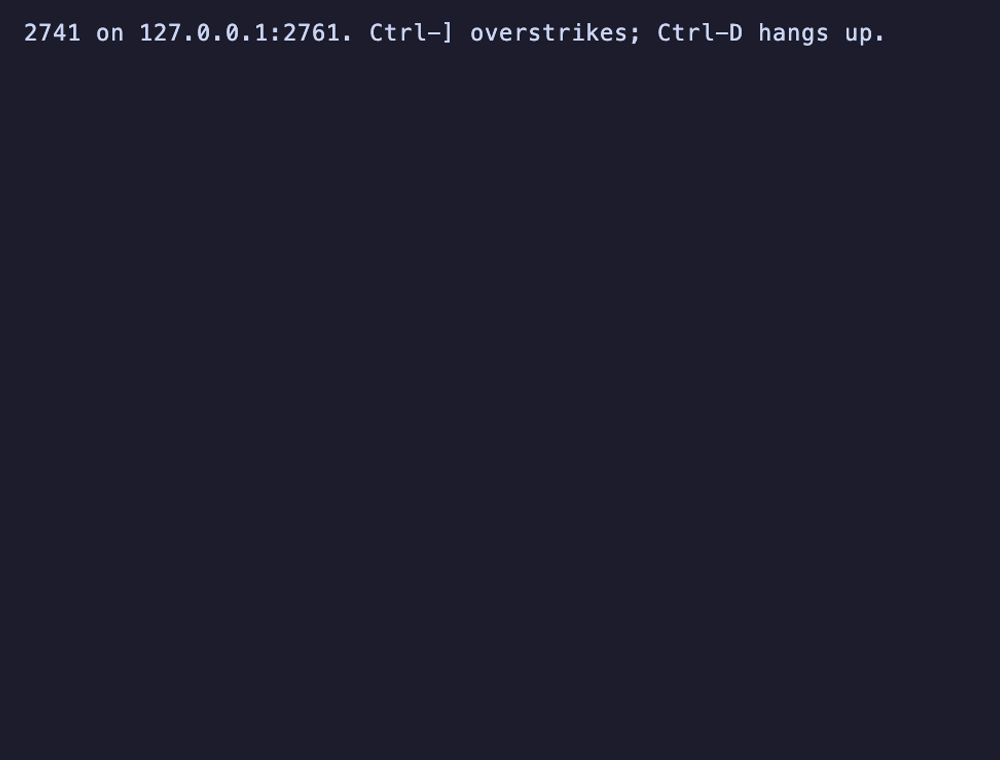

# sw-apl-workspaces

A library of APL workspaces for
[sw-apl](https://github.com/sw-vibe-coding/sw-apl), the clean-room
APL interpreter: a course that teaches APL from nothing, a drill
that sets exercises and marks the answers, a statistics workspace,
and a set of mathematics workspaces. Every one is written here from
scratch, under the MIT licence, and kept apart from the interpreter
so that it can grow without it.

sw-apl has two modes, (A) '70 (modelled on APL\360) and (B) '75
(modelled on the APL of the IBM 5100 family). A workspace here runs
in both wherever both can run it, and its file name says which:

| Runs in | File |
|---|---|
| (A) and (B) | `NAME.apl.ws` |
| (A) only | `NAME.a-70.apl.ws` |
| (B) only | `NAME.b-75.apl.ws` |

An (A) session never lists or loads a (B)-only workspace, and the
other way round; the modes line inside the file is the authority and
a gate checks the name agrees with it.

## The workspaces

In `ws/`. Each is a plain text file that APL can re-execute, and each
has a `DESCRIBE` that says what it holds and what to type next.

| Workspace | Modes | What it is |
|---|---|---|
| COURSE | both | APL in sixteen lessons, with a quiz after each, marked as you go: `START` |
| DRILL | a version for each | Exercises made at random and marked: `EASY`, `DRILL`, `HARD`; in (B), `WRITE` as well |
| STATS | both | Descriptive statistics, regression by domino, t and chi-square tests, the normal distribution, random samples |
| MATH | both | Primes, factors, gcd, totient, Fibonacci, Pascal, permutations and combinations, base conversion, Roman numerals |
| PLOT | both | Character plots that fit 64 columns: `PLOT`, `GRAPH`, `SCATTER`, `BAR` |
| MATRIX | both | Linear algebra over domino: determinant, inverse, solve |
| EIGENCUBE | both | Exact integer 3-D cubelet coordinates and quarter-turn geometry |
| RUBIK | both | A readable letter-net Rubik's Cube: `SHOW`, `TURN`, `SCRAMBLE`, `STEP`, `UNDO`, `SOLVE`, `RESET`, `SOLVED` |
| POLY | both | Polynomials as coefficient vectors: evaluate, add, multiply, divide, differentiate, integrate, real roots, write out |
| CALC | both | Simpson integration, derivatives, Newton and bisection, series for e, pi and sine |

Every one is written and pinned by a transcript in each mode it
runs in; `docs/plan.md` is the plan they came from.

The 2741 terminal that sw-apl ships, dialled into a local service
with this library, drawing a sine wave with PLOT:



## Use it

sw-apl finds a library by directory at the terminal and by URL in
the browser, and this repository is library 2 in the numbering
`)LIBS` reports: 0 is yours, 1 is what sw-apl ships, 2 is here.

```
      )LIBS
0 USER
1 CORE
2 EXTENDED
      )LIB 2
COURSE
DRILL
      )LOAD 2 COURSE
      DESCRIBE
      START
```

At the terminal, give sw-apl the directory and the name:

```bash
sw-apl --lib 2=/path/to/sw-apl-workspaces/ws,EXTENDED
sw-apl --mode 75 --lib 2=/path/to/sw-apl-workspaces/ws,EXTENDED
```

or keep it in `sw-apl.toml`, beside where sw-apl runs or in the
user's configuration directory, so the flag need not be typed:

```toml
[[library]]
number = 2
name = "EXTENDED"
path = "/path/to/sw-apl-workspaces/ws"
```

`sw-apl-server` takes the same flag and file, so the 2741 terminal
and the local browser page see the library too. The published demo
at sw-apl.softwarewrighter.com reads this repository's `ws/` over
the network, so `)LOAD 2 COURSE` works there with nothing installed.
`just apl` here starts a session with the library configured.

## Building and testing

There is nothing to build. A workspace is tested by running it
through sw-apl in every mode it claims, with every input scripted,
and pinning the transcript with reg-rs, one test per sample in
`samples/`. The binary is `SW_APL` if set, else the release build in
the sw-apl checkout beside this one, else `sw-apl` on the path.

```bash
just gates           # markdown, provenance, modes, the random link
just check           # every workspace, every mode it claims, no errors
scripts/reg.sh run   # transcript regressions (reg-rs), one per sample,
                     # and the oracle's pinned report
just samples         # print every sample's transcript
just oracle          # sw-apl in process on random inputs against
                     # statrs and nalgebra, both modes (Rust toolchain)
just bench           # the same subjects timed in APL and in Rust
just tape            # re-record images/plot.gif and .webp (vhs, ffmpeg)
```

## Documentation

This README is plain ASCII, so it reads the same everywhere; the
documents show real APL glyphs.

- [Master plan](docs/plan.md) -- goal, constraints, phases, decisions
- [Workspaces](docs/workspaces.md) -- the conventions every workspace
  here follows: DESCRIBE, HOWNAME, prompts, STOP, 64 columns
- [Testing](docs/testing.md) -- transcripts, reg-rs, the gates, the
  oracle
- [Performance](docs/performance.md) -- the same subjects timed in
  APL and in Rust, and what the shape of the gap means for how the
  workspaces are written
- [The library](docs/library.md) -- how sw-apl reaches this
  repository at the terminal, the service and the browser
- [Citations](docs/citations.md) -- every source consulted, none
  copied
- [Saga log](docs/saga.md) -- long-form notes per saga

For the interpreter itself, its file format and what each mode has,
see sw-apl's own documentation.

## Repository layout

```
ws/           the workspaces, and library.json, the index sw-apl's
              browser demo reads from this repository
samples/      one transcript sample per workspace: loads it, runs
              DESCRIBE, exercises every public function with
              scripted input
tests/reg-rs  the pinned transcripts
scripts/      gates, the sample and reg-rs runners,
              the index and change-log generators
oracle/       a cargo workspace: the independent oracle, cargo tests
              that check the workspaces' numbers against references
docs/         plan, conventions, testing, citations, the vhs tape
images/       the recording of the terminal drawing with PLOT, and
              plot/index.html, a page to view it in a browser locally
work/         library 0 and scratch; not tracked
```

## Provenance

Every workspace under `ws/` carries a line saying it was written for
this repository, and `scripts/check-provenance.sh` fails the build
when one does not. The point is what committing without it would
mean: the historical workspaces this library is in the spirit of --
APLCOURSE, TYPEDRILL, STATPAK and the rest of APL\360's library 1 --
are IBM or STSC material of unclear copyright, and nothing here is
converted, decoded or quoted from them. Their manuals say what such a
workspace did; every line of APL here is ours. Material from
elsewhere belongs in `work/`, which is not tracked.

## Links

- Blog: [Software Wrighter Lab](https://software-wrighter-lab.github.io/)
- Discord: [Join the community](https://discord.com/invite/Ctzk5uHggZ)
- YouTube: [Software Wrighter](https://www.youtube.com/@SoftwareWrighter)

## Copyright

Copyright (c) 2026 Michael A Wright. See [COPYRIGHT](COPYRIGHT).

## License

MIT License. See [LICENSE](LICENSE). Every workspace, sample, script
and document here is under it.
